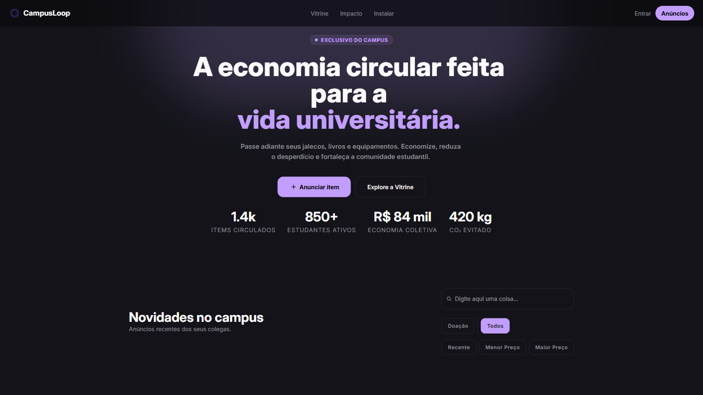
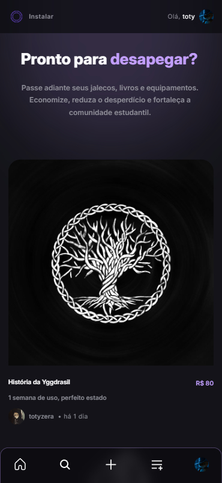

<div align="center">

# 🎓 CampusLoop

### Plataforma de compra, venda e doação de itens universitários

Uma aplicação Full-Stack desenvolvida como desafio técnico para o processo seletivo do Laboratório Vortex (Unifor), permitindo que estudantes anunciem, encontrem e negociem produtos dentro do ambiente acadêmico de forma simples, rápida e organizada.

## 📑 Navegação

<div style="display: flex; gap: .5rem; scroll-behavior: smooth; justify-content: center;">

- [📖 Sobre](#-sobre-o-projeto)
- [✨ Funcionalidades](#-funcionalidades)
- [📷 Demonstração](#-demonstração)
- [🏗 Arquitetura](#-arquitetura)
- [🛠 Tecnologias](#-tecnologias-utilizadas)
- [⚙️ Instalação](#️-como-executar-localmente)
- [🌐 Deploy](#-deploy)
- [🤖 Diário de Bordo da IA](#-diário-de-bordo-da-ia)
- [📄 Licença](#-licença)

</div>

</div>

<div align="center">

# 📖 Sobre o projeto

</div>

O **CampusLoop** é um marketplace universitário desenvolvido para conectar estudantes interessados em comprar, vender ou doar materiais acadêmicos, promovendo o reaproveitamento de recursos dentro da comunidade universitária por meio de uma experiência moderna, responsiva e segura.

Além da funcionalidade principal de marketplace, o projeto foi desenvolvido com foco em:

- arquitetura escalável;
- boas práticas de desenvolvimento;
- experiência de usuário;
- cache inteligente;
- autenticação segura;
- organização de código;
- responsividade;
- Progressive Web App (PWA).

## 🚀 Destaques

- Marketplace universitário
- Autenticação completa com Supabase
- Cache inteligente (Stale While Revalidate)
- PWA instalável
- Upload de imagens
- API REST
- Arquitetura em camadas
- Responsividade Desktop + Mobile

<div align="center">

# ✨ Funcionalidades

</div>

## Autenticação

- Login
- Cadastro
- Logout
- Recuperação de senha por e-mail
- Redefinição de senha
- Persistência de sessão
- Atualização automática do token

## Marketplace

- Publicação de anúncios
- Exclusão de anúncios
- Upload de imagens
- Pesquisa por texto
- Filtro por categoria
- Filtro por doação
- Ordenação por:
  - mais recentes
  - menor preço
  - maior preço

## Experiência

- Cache utilizando estratégia **Stale While Revalidate**
- Feedback visual através de Toasts independentes
- Loading states
- Interface totalmente responsiva
- PWA instalável

<div align="center">

# 📷 Demonstração

</div>

<div align="center">

## Desktop

  

## Mobile

  

</div>

<div align="center">

# 🏗 Arquitetura

</div>

O projeto foi dividido em três repositórios independentes.

```text
CampusLoop
│
├── client <- Frontend
│
├── server <- Backend
│
└── supabase <- .SQL
```

## Frontend

```text
src
│
├── api
├── assets
├── components
├── context
├── hooks
├── pages
├── services
├── constants
├── types
├── utils
└── main.tsx
```

O Frontend utiliza uma arquitetura baseada em responsabilidades, separando claramente:

- Componentes reutilizáveis
- Hooks
- Serviços
- Contextos
- Tipagens
- Utilitários

## Backend

```text
src
│
├── controllers
├── middlewares
├── repositories
├── routes
├── schemas
├── services
├── types
├── utils
├── app.ts
└── server.ts
```

Foi adotada uma arquitetura em camadas:

```
Request

↓

Routes

↓

Middlewares

↓

Controllers

↓

Services

↓

Repository

↓

Supabase
```

Toda requisição percorre uma arquitetura em camadas, permitindo validações, autenticação, tratamento de erros e separação clara das responsabilidades.

Essa separação facilita manutenção, testes e evolução do projeto.

<div align="center">

# 🛡 Tratamento de requisições

</div>

O backend foi estruturado para responder de maneira consistente aos diferentes cenários de erro.

Entre as estratégias utilizadas estão:

- Middleware global de erros
- Validação com Zod
- Respostas HTTP padronizadas
- Tratamento de autenticação JWT
- Tratamento de recursos inexistentes
- Tratamento de erros do Supabase

<div align="center">

# 🎯 Principais decisões técnicas

</div>

Durante o desenvolvimento algumas decisões foram tomadas visando escalabilidade e manutenção.

- Arquitetura em camadas
- Separação entre Services e Repository
- Cache SWR
- Debounce nas pesquisas
- Context API para autenticação
- Context API para Toasts
- Componentização reutilizável
- Tipagem completa com TypeScript

<div align="center">

# 🛠 Tecnologias utilizadas

</div>

## Frontend

- React 19
- TypeScript
- React Router
- TailwindCSS
- React Icons
- Vite

## Backend

- Node.js
- Express
- TypeScript
- Supabase
- Zod
- JWT

## Banco de dados

- PostgreSQL (Supabase)

## Infraestrutura

- Railway
- Vercel
- Supabase

## Ferramentas

- Git
- GitHub
- Figma
- Excalidraw

<div align="center">

# ⚙️ Como executar localmente

</div>

## Pré-requisitos

- Node.js 22+
- npm
- Git

Também é necessário possuir:

- projeto no Supabase
- variáveis de ambiente configuradas

Antes de iniciar o projeto execute os scripts SQL presentes em:

```text
supabase
  └──  schema
```

e

```text
supabase
  └──  policies
```

<div align="center">

# 📥 Clonando o projeto

</div>

```bash
git clone https://github.com/SamuelBarbosa11/CampusLoop.git
```

---

## Frontend

```bash
cd client
```

Instale as dependências:

```bash
npm install
```

Crie um arquivo:

```text
.env
```

Configure as variáveis:

```env
VITE_API_URL=
VITE_SUPABASE_URL=
VITE_SUPABASE_PUBLISHABLE_KEY=
```

Execute:

```bash
npm run dev
```

Aplicação disponível em:

```
http://localhost:5173
```

## Backend

```bash
cd server
```

Instale as dependências:

```bash
npm install
```

Crie:

```text
.env
```

Configure:

```env
PORT=

SUPABASE_URL=

SUPABASE_SERVICE_ROLE_KEY=

IMGBB_API_KEY=
```

Execute:

```bash
npm run dev
```

Servidor disponível em:

```
http://localhost:3001 (ou "localhost:PORT" com a PORT alocada no .env)
```

<div align="center">

# 🌐 Deploy

</div>

<div align="center">

### Frontend

</div>

<div align="center">
  <a href="https://campusloop-vortex.vercel.app/" target="_blank" style="text-decoration: none;">
    <button style="background-color: #28282f; color: white; padding: 10px 20px; border: none; border-radius: .5rem; font-size: 1rem; font-weight: bold; cursor: pointer; box-shadow: 0 4px 6px rgba(0,0,0,0.1);">
      🔺 Vercel
    </button>
  </a>
</div>

<div align="center">

### Backend

</div>

<div style="display: flex; flex-direction: column; justify-content: center; align-items: center; margin-bottom: 3rem;">
  <button style="background-color: #8e8e98; color: white; padding: 10px 20px; border: none; border-radius: .5rem; font-size: 1rem; font-weight: bold; cursor: default; box-shadow: 0 4px 6px rgba(0,0,0,0.1); margin-bottom: .5rem;">
    🚅 Railway
  </button>
  Consumo da API é feita de forma interna pelo Frontend
</div>

<div align="center">

# 🤖 Diário de Bordo da IA

</div>

Essa seção documenta como ferramentas de Inteligência Artificial foram utilizadas durante o desenvolvimento do projeto, conforme solicitado pelo desafio técnico do Laboratório Vortex.

O objetivo da IA não foi substituir o desenvolvimento, mas atuar como parceira para validação de arquitetura, investigação de bugs, discussão de soluções e aceleração do processo de aprendizado.

## Ferramentas utilizadas

Durante o desenvolvimento foram utilizadas as seguintes ferramentas:

- ChatGPT (OpenAI GPT-5.5) - Discussão de arquitetura, debugging, revisão de código, boas práticas e documentação
- Loveable + plugin no Figma - Planejamento visual da interface

## Como a IA foi utilizada

A IA participou como ferramenta de apoio durante todo o desenvolvimento, principalmente em:

- Discussão de arquitetura
- Revisão de código
- Investigação de bugs
- Validação de boas práticas
- Geração de documentação
- Comparação entre diferentes abordagens de implementação

Toda sugestão foi validada por meio de reflexões críticas, entendimento do conteúdo gerado(sem o uso cego como ferramenta de geração automizada) e testes práticos antes de ser incorporada ao projeto.

## Estratégia de Engenharia de Prompts

Ao longo do desenvolvimento, a IA foi utilizada principalmente para discutir arquitetura e solucionar problemas específicos.

A seguir estão alguns exemplos reais de prompts utilizados.

### Exemplo 1 — Arquitetura de autenticação

"Meu projeto possui um AuthProvider utilizando Supabase. Quero reutilizar a mesma tela para Login, Cadastro, Recuperação e Redefinição de senha sem duplicar componentes. Como estruturar essa arquitetura mantendo o código escalável?"

Resultado:

- reorganização do fluxo de autenticação
- reutilização dos componentes de formulário
- simplificação do gerenciamento de estados
- redução de duplicação de código

---

### Exemplo 2 — Sistema de cache

"Estou implementando um cache utilizando a estratégia Stale While Revalidate. Como estruturar um hook reutilizável que primeiro utilize os dados em cache e atualize em segundo plano mantendo a interface responsiva?"

Resultado:

- criação do hook useCachedResource
- separação entre cache e atualização
- melhoria perceptível na experiência do usuário
- atualização transparente dos dados

---

### Exemplo 3 — Sistema global de Toasts

"Cada Toast precisa ser independente para que o fechamento de um não afete os demais. Como posso redesenhar meu Provider para permitir múltiplos Toasts simultâneos mantendo animações suaves de entrada e saída?"

Resultado:

- Provider baseado em lista de Toasts
- identificadores únicos
- timers independentes
- animações desacopladas
- maior previsibilidade do fluxo
- Compartilhamento do histórico

Durante praticamente todo o desenvolvimento foi mantida uma conversa contínua registrando decisões de arquitetura, resolução de bugs, validação de soluções e refinamentos do projeto.

## Link público da conversa:

🔗 [Link compartilhado do ChatGPT](https://chatgpt.com/share/6a68380a-31f8-83e9-b257-94f3faca884b)

## Reflexão crítica

Embora a IA tenha acelerado significativamente o desenvolvimento, diversas respostas precisaram ser questionadas, refinadas ou descartadas após testes práticos.

### Caso 1 — Arquitetura de Toasts

Na implementação inicial do sistema global de Toasts foi sugerido manter apenas um estado global.

Durante os testes foi identificado que múltiplos processos assíncronos poderiam interferir entre si, fazendo com que um Toast encerrasse outro prematuramente.

Após análise do comportamento real da aplicação, o fluxo foi redesenhado para utilizar:

- lista de Toasts
- IDs únicos
- timers independentes
- remoção individual com animação

Essa solução tornou o comportamento completamente previsível.

---

### Caso 2 — Organização da autenticação

Durante a implementação do fluxo de autenticação algumas sugestões geravam uma arquitetura excessivamente acoplada.

Após compreender melhor os eventos do Supabase e o comportamento do Context API, foi possível reorganizar a estrutura, reduzindo responsabilidades dos componentes e centralizando o gerenciamento da sessão.

---

### Caso 3 — Filtros do Dashboard

Durante a implementação dos filtros do Dashboard, a investigação inicialmente concentrou-se no Frontend.

Após diversas análises foi identificado que o problema estava no Backend, onde o endpoint responsável pelos anúncios do usuário ignorava completamente os filtros enviados na requisição.

A solução adotada consistiu em reutilizar a lógica existente do método responsável pelos anúncios públicos, adicionando apenas o **user_id** aos filtros, eliminando duplicação de código e mantendo um único fluxo de consulta.

Esse processo reforçou a importância de validar hipóteses antes de assumir que o erro está em uma camada específica da aplicação.

<div align="center">

# ⏱️ Roadmap de desenvolvimento

</div>

Durante o desafio foi utilizado um planejamento diário para organizar entregas, prioridades e evolução do projeto.

<div align="center">

  

</div>

<div align="center">

# 📚 Aprendizados

</div>

Durante o desenvolvimento deste desafio foi possível aprofundar conhecimentos em:

- Arquitetura em camadas
- APIs REST
- Context API
- Supabase
- PostgreSQL
- Autenticação JWT
- Cache Stale While Revalidate
- Progressive Web Apps (PWA)
- Organização de projetos Full Stack
- Engenharia de Prompts aplicada ao desenvolvimento de software

<div align="center">

# 📄 Licença

</div>

Este projeto foi desenvolvido exclusivamente para fins educacionais como parte do desafio técnico do processo seletivo do Laboratório Vortex (Universidade de Fortaleza - Unifor).

O código permanece disponível para fins de estudo, aprendizado e avaliação técnica.
